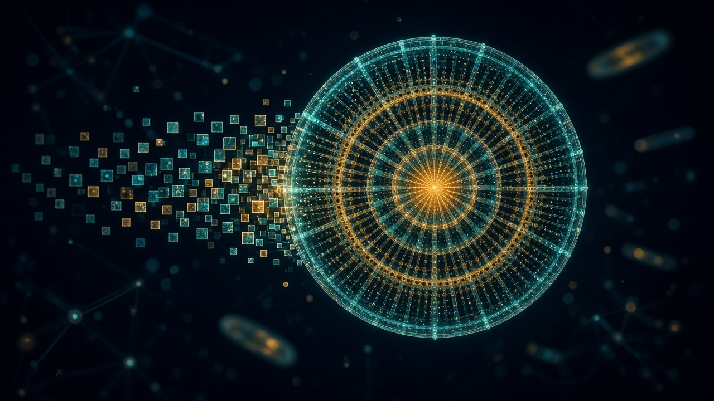

# 🦠 Diatom NCA — a new kind of AI Automata



**Neural Cellular Automata for morphogenesis, down the Diatom road.**

One tiny neural network, copied into every cell. No blueprint, no coordinator —
each cell sees only its 3×3 neighbourhood, yet a glass diatom frustule grows
from a single cell. *Order from local rules.* Cut it in half and it heals.
Play sound and the organism bends — because **audio is fed into the model's
weights** (FiLM conditioning that retunes the local rule every step).

Inspired by diatoms: single cells that build cathedrals of silica —
radial centric discs, bilateral pennate boats, pores in rows, ribs, raphes.
If nature can do that with local chemistry, our automata can learn it with
local computation.

---

## What we built (and what you can fine-tune)

| Your idea | Where it lives | How to play |
|---|---|---|
| **Morphogenesis / order from local rules** | `nca/model.py` — `DiatomNCA`: fixed Sobel perception + 2-layer update MLP, stochastic fire rate, alive masking | `python scripts/demo_grow.py` → `assets/demo_grow.gif` |
| **The Diatom road** | `nca/diatom.py` — procedural `centric_diatom()` / `pennate_diatom()` targets: girdle, ribs, striae, areolae pores, raphe, rosette | `sample_target()` / `batch_targets()` — infinite frustule dataset, no downloads |
| **Regeneration creature** | `nca/utils.py` damage ops + `nca/train.py` pool training that damages half of every batch | `python scripts/demo_regenerate.py` → cut → heal GIF |
| **Feed audio into the weights** | `nca/audio.py` + FiLM in `nca/model.py`: 8-dim sound vector → γ/β that scale/shift every hidden neuron + fire-rate + AUDIO sense channel | `python scripts/demo_audio.py --kind beat` or `--wav your.wav` |
| **Extra cell channels (16)** | `0:2` RGB pigment · `3` alpha/maturity · `4:7` DNA genome · `8:10` morphogen memory · `11` AUDIO sense · `12:15` hidden/silica state | fix DNA per organism to steer fate; read channel 11 as the cell's memory of sound |
| **Live in the browser** | `web/demo.html` — pure-JS NCA, mic + synth conditioning, cut/genome/symmetry controls | open the file, no server; `scripts/export_weights.py` drops trained weights in |
| **It talks** | `nca/voice.py` — sonification: growth → stereo pentatonic song (mass→pitch, pigment→chord, growth→loudness, position→pan) | `python scripts/demo_voice.py` → creature sings, then grows under its own song |

## Quickstart

```bash
pip install -r requirements.txt

# 1. grow primordial soup (no training needed)
python scripts/demo_grow.py
# 2. cut it in half, watch it try to heal
python scripts/demo_regenerate.py
# 3. grow it under synthetic sound
python scripts/demo_audio.py --kind beat
#    ...or your own audio
python scripts/demo_audio.py --wav path/to/sound.wav

# 4. train a real diatom-grower (CPU-friendly; ~minutes for a smoke run)
python scripts/train_diatom.py --steps 3000 --size 48
# 5. use the trained creature everywhere
python scripts/demo_grow.py --checkpoint assets/checkpoint.pt
python scripts/demo_regenerate.py --checkpoint assets/checkpoint.pt
python scripts/demo_audio.py --checkpoint assets/checkpoint.pt --kind bloom
python scripts/demo_voice.py --checkpoint assets/checkpoint.pt  # it sings 🎵
python scripts/export_weights.py  # -> web/weights.json for the browser demo

# 6. run the tests
pytest -q
```

Then open `web/demo.html` in a browser: reseed, cut, new genome, symmetry mode,
mic/synth conditioning with live feature meters.

> **Zero-setup route:** run it in the cloud —
> [](https://colab.research.google.com/github/AaronGrace978/Automata/blob/main/notebooks/diatom_nca_colab.ipynb)
> (`notebooks/diatom_nca_colab.ipynb`: targets gallery → train → timelapse → surgery → sound → new species).

## How it works

**The cell.** State is a 16-channel grid. Each step, every cell perceives its
neighbourhood with fixed kernels (identity + Sobel x/y per channel → 48-dim
perception), feeds it through `Linear(48→128) → ReLU → FiLM(audio) → Linear(128→16)`,
and adds the residual with probability `fire_rate`, gated by the alive mask
(`maxpool(alpha) > 0.1`). The last layer is zero-initialised, so birth starts
near-identity instead of exploding — the standard NCA trick.

**The sound.** An 8-dim vector —
`energy, centroid, flux, beat, low, mid, high, contrast` (`nca/audio.py`) —
is encoded to `(γ, β)` that modulate the hidden layer: `h ← h·(1+γ) + β`.
Energy additionally scales the fire rate (loud = fast growth) and accumulates
in the AUDIO sense channel, so tissue *remembers* recent loudness. Training
samples random audio vectors (`audio_prob=0.5`) so the creature stays
controllable-but-stable under any sound.

**The diatoms.** `nca/diatom.py` synthesises centric (n-fold radial, rings,
ray ribs, pore rows, central rosette) and pennate (boat valve, raphe slit,
transverse striae, polar nodules) frustules in gold-glass / abyss / bloom
palettes. They are the morphogenetic targets: `train_diatom.py` grows a pool
of organisms toward them with rollout range 32–64, worst-organism reseeding,
and circle/half damage on half of all batches — regeneration is *trained in*.

**The genome.** Channels 4–7 are a per-organism constant (`seed(genome=...)`).
Same rule + different genome → different frustule. Fix the genome to clone,
mutate it to evolve, interpolate two genomes to morph one diatom into another.

## Fine-tune road (where to go next)

- **Bigger creatures**: `--size 64/96`, `hidden 192`, longer rollouts; add a Laplacian kernel to perception.
- **Real diatom data**: swap `batch_targets()` for SEM images (e.g. neuronal diatom datasets); keep the pool + damage loop unchanged.
- **Richer audio**: beat-phase waves, chroma → palette rotation, onset → pore bursts; condition the *genome* on a full track for "song → species".
- **Evo search**: mutate genomes / rule weights with CMA-ES against symmetry + pore-regularity fitness; keep the prettiest frustules.
- **3D frustules**: lift the grid to 3D convolutions — girdle bands become real cylinders.

## Layout

```text
nca/model.py      the local rule (audio-FiLM NCA, 16 channels)
nca/diatom.py     procedural diatom targets (centric + pennate)
nca/audio.py      wav/synth -> 8-dim conditioning vectors
nca/train.py      pool training + regeneration + audio augmentation
nca/utils.py      visualisation (GIF/grid) + damage probes
scripts/          train / grow / regenerate / audio / export_weights
web/demo.html     interactive browser creature (mic + synth + surgery)
tests/test_nca.py smoke tests for rule, targets, audio, training step
assets/           checkpoints + generated GIFs (gitignored outputs)
```

## References

- Mordvintsev et al., *Growing Neural Cellular Automata* (2020) — pool training, regeneration.
- Niklasson et al., *Self-Organising Textures / Flow Lenia-ish NCA variants* — stochastic updates, alive masking.
- Diatom frustule literature: Round, Crawford & Mann, *The Diatoms* — symmetry, areolae, raphe nomenclature borrowed for the generator.

## White paper

The full research write-up lives in [`WHITEPAPER.md`](WHITEPAPER.md) —
*Diatom NCA: Audio-Conditioned Neural Cellular Automata for Diatom
Morphogenesis* — with method, experiments, and references. If you use this
work, please cite it (see [`CITATION.cff`](CITATION.cff)).

## Author

**Aaron Alexander Grace, M.Ed.** — Independent AI researcher. Master's degree
in Education (Higher Education Administration), University of Massachusetts
Lowell, plus several professional certificates. This project is his research
contribution to the AI space: order from local rules, down the Diatom road.
