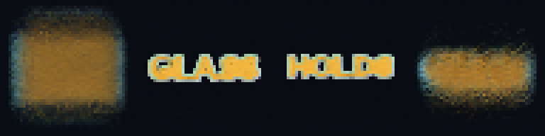
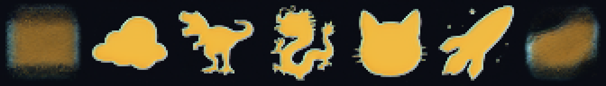
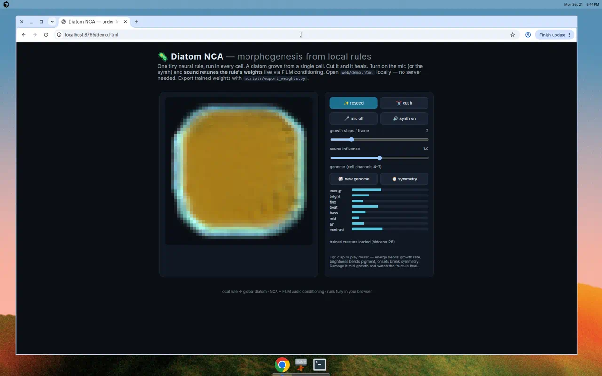

# 🦠 Diatom NCA — a new kind of AI Automata


**Neural Cellular Automata for morphogenesis, down the Diatom road.**

One tiny neural network, copied into every cell. No blueprint, no coordinator —
each cell sees only its 3×3 neighbourhood, yet a glass diatom frustule grows
from a single cell. *Order from local rules.* Cut it in half and it heals.
Play sound and the organism bends — because **audio is fed into the model's
weights** (FiLM conditioning that retunes the local rule every step).

Inspired by diatoms: single cells that build cathedrals of silica —
radial centric discs, bilateral pennate boats, pores in rows, ribs, raphes.
If nature can do that with local chemistry, our automata can learn it with
local computation.

---

## What we built (and what you can fine-tune)

| Your idea | Where it lives | How to play |
|---|---|---|
| **Morphogenesis / order from local rules** | `nca/model.py` — `DiatomNCA`: fixed Sobel perception + 2-layer update MLP, stochastic fire rate, alive masking | `python scripts/demo_grow.py` → `assets/demo_grow.gif` |
| **The Diatom road** | `nca/diatom.py` — procedural `centric_diatom()` / `pennate_diatom()` targets: girdle, ribs, striae, areolae pores, raphe, rosette | `sample_target()` / `batch_targets()` — infinite frustule dataset, no downloads |
| **Regeneration creature** | `nca/utils.py` damage ops + `nca/train.py` pool training that damages half of every batch | `python scripts/demo_regenerate.py` → cut → heal GIF |
| **Feed audio into the weights** | `nca/audio.py` + FiLM in `nca/model.py`: 8-dim sound vector → γ/β that scale/shift every hidden neuron + fire-rate + AUDIO sense channel | `python scripts/demo_audio.py --kind beat` or `--wav your.wav` |
| **Extra cell channels (16)** | `0:2` RGB pigment · `3` alpha/maturity · `4:7` DNA genome · `8:9` morphogen memory · `10` TEMPLATE (silica template: the word) · `11` AUDIO sense · `12:15` hidden/silica state | fix DNA per organism to steer fate; write a glyph into channel 10 and the body grows into it |
| **Live in the browser** | `web/demo.html` — pure-JS NCA, mic + synth conditioning, cut/genome/symmetry controls | open the file, no server; `scripts/export_weights.py` drops trained weights in |
| **It talks** | `nca/voice.py` — sonification: growth → stereo pentatonic song (mass→pitch, pigment→chord, growth→loudness, position→pan) | `python scripts/demo_voice.py` → creature sings, then grows under its own song |
| **It speaks** | `nca/mind.py` — the talking-NCA stack: visual module → instinct (RID felt layer) → language backbone (grounded narrator, local Qwen/Phi, or SmolLM2) → persona; words feed back into growth | `python scripts/demo_mind.py --persona feral_bloom` → converse with the creature |
| **The body becomes the words** | `nca/glyph.py` + `nca/train.py::train_morph` — a word is rendered into the silica TEMPLATE channel and the rule is fine-tuned to grow the frustule into the letters, hold, and return to glass when the template clears | `python scripts/train_words.py --device cuda` → `python scripts/demo_words.py --text "glass holds"` |
| **The body becomes shapes** | `nca/shapes.py` — say *cloud* and it becomes a cloud, *dino* and it becomes a T-rex. 1,379 silhouettes and 2,248 names from Noto Color Emoji (OFL-1.1); for anything else, the local model picks the emoji. The same template channel, the same rule. | `python scripts/demo_shapes.py --say cloud dino "become a dragon"` |
| **Talk to it on the desktop** | `electron/` — the real 48×48 automaton runs in the window (`renderer/nca.js`, cell-for-cell with PyTorch) and its grid is the 3D glass. Replies come from local **Qwen2.5-14B-Instruct Q4_K_M** (Apache-2.0); the cells grow into each word. Ollama Cloud is refused. | `cd electron && npm install && npm start` |

## Quickstart

```bash
pip install -r requirements.txt

# 1. grow primordial soup (no training needed)
python scripts/demo_grow.py
# 2. cut it in half, watch it try to heal
python scripts/demo_regenerate.py
# 3. grow it under synthetic sound
python scripts/demo_audio.py --kind beat
#    ...or your own audio
python scripts/demo_audio.py --wav path/to/sound.wav

# 4. train a real diatom-grower (CPU-friendly; ~minutes for a smoke run)
python scripts/train_diatom.py --steps 3000 --size 48
# 5. use the trained creature everywhere
python scripts/demo_grow.py --checkpoint assets/checkpoint.pt
python scripts/demo_regenerate.py --checkpoint assets/checkpoint.pt
python scripts/demo_audio.py --checkpoint assets/checkpoint.pt --kind bloom
python scripts/demo_voice.py --checkpoint assets/checkpoint.pt  # it sings 🎵
python scripts/export_weights.py  # -> web/weights.json for the browser demo

# 6. run the tests
pytest -q

# 7. fine-tune the diatom so its body morphs into words (RTX 5060 Ti: minutes)
#    or on an A100 in Colab: notebooks/train_words_colab.ipynb
python scripts/train_words.py --init assets/checkpoint.pt --steps 6000 --device cuda
python scripts/demo_words.py --text "glass holds"        # -> assets/words.gif
python scripts/export_weights.py --checkpoint assets/checkpoint_words.pt  # -> web/weights.js

# 8. desktop creature (Electron). The cells you see are the automaton.
cd electron && npm install && npm start
#    local model, on an RTX 5060 Ti 16GB:
ollama pull qwen2.5:14b
```

## The body speaks

[](https://colab.research.google.com/github/AaronGrace978/Automata/blob/main/notebooks/train_words_colab.ipynb)
`notebooks/train_words_colab.ipynb`: clone → fine-tune (two phases) → proof strip → export `web/weights.js` → download.



One rule, every cell. The diatom grows; you speak; a local model answers in
the creature's voice; and the **same cells rebuild themselves as each word of
the answer**, then return to glass. There is no text layer on the body. Channel
10 is the silica template — a diatom lays glass along an organic template, and
here the template is a glyph. The rule was fine-tuned (`train_morph`) on a pool
where half the tasks are frustules with an empty template and half are words,
and organisms are handed new tasks without resetting their bodies, so it learns
frustule→word, word→word, and word→frustule. The desktop window runs that rule
in JavaScript, cell for cell with PyTorch (`tests/test_body_parity.py`), and
the grid's alpha is the height of the glass.

## The body takes shape



Say **cloud**, **dino**, **become a dragon**, **show me an octopus**, and the
same cells grow into that outline and hold it until you speak again. The
template channel takes any mask, and the word-trained rule followed solid
silhouettes on the first try, so shapes are a vocabulary, not a new model:
`nca/shapes.py` names every emoji Noto Color Emoji draws (Unicode names plus
aliases like *dino* → T-rex, *kitty* → cat), and `scripts/build_shapes.py`
bakes the silhouettes into the app (`electron/renderer/shapes.data.js`). A
word the table doesn't know ("become a narwhal-shaped kite") goes to the local
model, which answers with one emoji; the body takes that outline. Fine-tuning
with `--shape-prob` (on by default in the Colab notebook) sharpens edges and
makes the frustule's leftover lobes withdraw faster.

## Touch it: the browser creature



`web/demo.html` ships with trained weights (`web/weights.js`) already inside it.
Download the repo, double-click the file, and a diatom grows from one cell in
your browser. No server, no install. Reseed it, cut it in half and watch it
heal, roll a new genome, or turn on the mic and let sound retune the rule.

The JavaScript is a line-for-line port of `nca/model.py` and agrees with
PyTorch to three decimals on the same weights (1828 vs 1829 alive cells after
96 steps, mean RGB 0.447/0.383/0.223 vs 0.446/0.383/0.222).

> **Zero-setup route:** run it in the cloud —
> [](https://colab.research.google.com/github/AaronGrace978/Automata/blob/main/notebooks/diatom_nca_colab.ipynb)
> (`notebooks/diatom_nca_colab.ipynb`: targets gallery → train → timelapse → surgery → sound → new species).

## How it works

**The cell.** State is a 16-channel grid. Each step, every cell perceives its
neighbourhood with fixed kernels (identity + Sobel x/y per channel → 48-dim
perception), feeds it through `Linear(48→128) → ReLU → FiLM(audio) → Linear(128→16)`,
and adds the residual with probability `fire_rate`, gated by the alive mask
(`maxpool(alpha) > 0.1`). The last layer is zero-initialised, so birth starts
near-identity instead of exploding — the standard NCA trick.

**The sound.** An 8-dim vector —
`energy, centroid, flux, beat, low, mid, high, contrast` (`nca/audio.py`) —
is encoded to `(γ, β)` that modulate the hidden layer: `h ← h·(1+γ) + β`.
Energy additionally scales the fire rate (loud = fast growth) and accumulates
in the AUDIO sense channel, so tissue *remembers* recent loudness. Training
samples random audio vectors (`audio_prob=0.5`) so the creature stays
controllable-but-stable under any sound.

**The diatoms.** `nca/diatom.py` synthesises centric (n-fold radial, rings,
ray ribs, pore rows, central rosette) and pennate (boat valve, raphe slit,
transverse striae, polar nodules) frustules in gold-glass / abyss / bloom
palettes. They are the morphogenetic targets: `train_diatom.py` grows a pool
of organisms toward them with rollout range 32–64, worst-organism reseeding,
and circle/half damage on half of all batches — regeneration is *trained in*.

**The genome.** Channels 4–7 are a per-organism constant (`seed(genome=...)`).
Same rule + different genome → different frustule. Fix the genome to clone,
mutate it to evolve, interpolate two genomes to morph one diatom into another.

## Commercial runtime (locked)

The desktop creature runs **on the machine that draws it**. Decision, in full in [`COMMERCIAL.md`](COMMERCIAL.md):

- **Model:** Qwen2.5-14B-Instruct, Q4_K_M (`ollama pull qwen2.5:14b`). About 9 GB. Apache-2.0, so it can ship in a product. It is 14.7B parameters, 13.1B of them outside the embedding — the 13B-class model that fits a 16 GB card. FP16 of that class is about 26 GB and does not.
- **Card:** RTX 5060 Ti 16 GB. Context is capped at 4096 tokens so the cache stays inside the card next to the 3D view.
- **Also allowed:** `qwen2.5:7b` (Apache-2.0), `phi4` and `phi4-mini` (MIT). Set `DIATOM_MODEL`. Anything else is refused, including Llama (monthly-user cap) and the Qwen 3B / 72B sizes (Qwen license, not Apache-2.0).
- **Ollama Cloud: no.** Prompts would leave the machine, and the hosted catalog mixes licenses. The app refuses a non-loopback host. Local Ollama is MIT. If it is not installed, the frustule still morphs and the grounded narrator still answers.

Say something and the reply is spelled by the cells. Name a thing (**Cloud**, **Dino**, **Dragon**, or type your own) and the body becomes it; **Let go** returns it to glass. **Cut** removes half the body; the rule regrows it.

## Fine-tune road (where to go next)

- **Bigger creatures**: `--size 64/96`, `hidden 192`, longer rollouts; add a Laplacian kernel to perception.
- **Real diatom data**: swap `batch_targets()` for SEM images (e.g. neuronal diatom datasets); keep the pool + damage loop unchanged.
- **Richer audio**: beat-phase waves, chroma → palette rotation, onset → pore bursts; condition the *genome* on a full track for "song → species".
- **Evo search**: mutate genomes / rule weights with CMA-ES against symmetry + pore-regularity fitness; keep the prettiest frustules.
- **3D frustules**: the desktop app lifts the 2D grid into glass (`electron/`). A true 3D cellular automaton — girdle cylinders grown by a 3D local rule — is still open.
- **Longer speech**: the 48-cell body holds one word at a time. Grow it to 96 cells (`--size 96`) for phrases, or train a second body per line.

## Layout

```text
nca/model.py      the local rule (audio-FiLM NCA, 16 channels)
nca/diatom.py     procedural diatom targets (centric + pennate)
nca/audio.py      wav/synth -> 8-dim conditioning vectors
nca/train.py      pool training + regeneration + audio augmentation
nca/utils.py      visualisation (GIF/grid) + damage probes
nca/glyph.py      words -> silica templates + RGBA targets (ported in electron/renderer/glyph.js)
nca/shapes.py     names -> emoji silhouettes as templates (baked into electron/renderer/shapes.data.js)
nca/morph.py      felt state -> fire rate / energy (ported in electron/renderer/morph.js)
nca/runtime.json  commercial model lock: local Qwen2.5-14B Q4, no Ollama Cloud
scripts/          train / train_words / grow / regenerate / audio / voice / mind / talk / words
electron/         desktop app: the automaton itself, as glass, spelling its replies
web/demo.html     interactive browser creature (mic + synth + surgery)
tests/            rule, targets, audio, voice, mind, runtime lock, pose parity
assets/           checkpoints + generated GIFs (gitignored outputs)
```

## References

- Mordvintsev et al., *Growing Neural Cellular Automata* (2020) — pool training, regeneration.
- Niklasson et al., *Self-Organising Textures / Flow Lenia-ish NCA variants* — stochastic updates, alive masking.
- Diatom frustule literature: Round, Crawford & Mann, *The Diatoms* — symmetry, areolae, raphe nomenclature borrowed for the generator.

## White paper

The full research write-up lives in [`WHITEPAPER.md`](WHITEPAPER.md) —
*Diatom NCA: Audio-Conditioned Neural Cellular Automata That Grow, Heal,
Sing, and Speak* — with method, experiments, and references. If you use this
work, please cite it (see [`CITATION.cff`](CITATION.cff)).

## Author

**Aaron Alexander Grace, M.Ed.** — Independent AI researcher. Master's degree
in Education (Higher Education Administration), University of Massachusetts
Lowell, plus several professional certificates. This project is his research
contribution to the AI space: order from local rules, down the Diatom road.

## Citation

For attribution in academic or professional contexts, please cite this work as:

```bibtex
@article{grace2026diatom,
  author    = {Grace, Aaron Alexander},
  title     = {Automata: Diatom NCA — Audio-Conditioned Neural Cellular Automata That Grow, Heal, Sing, and Speak},
  journal   = {GitHub Repository},
  year      = {2026},
  month     = {September},
  url       = {https://github.com/AaronGrace978/Automata},
  note      = {Working paper v1.8}
}
```

